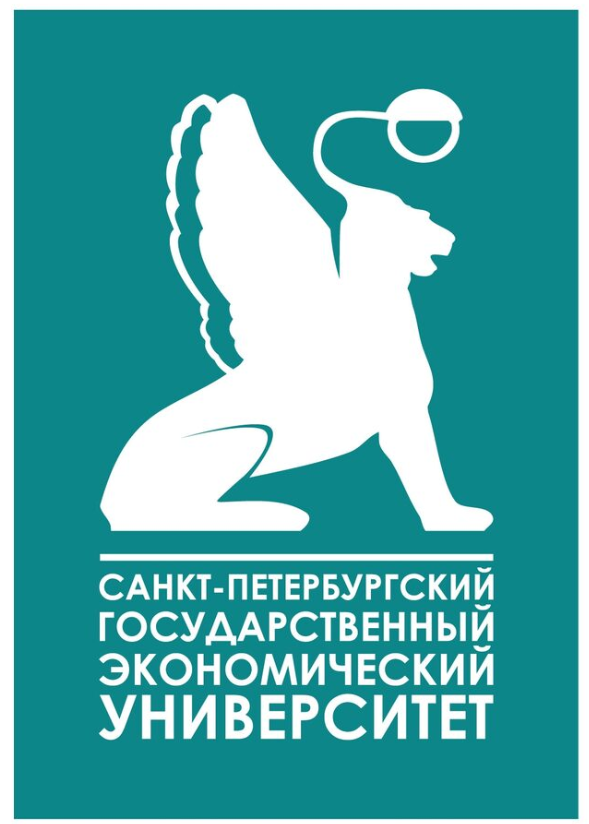

<h1 align="center">Hi there, I'm Ekaterina👋</h1> 
<h3 align="center">QA Engineer 🛠️</h3> 

About Me 👩‍💻
---
С **5-летним опытом** ручного тестирования веб-приложений. Работала с фронтендом и бэкендом, тестировала API, участвовала в полном цикле разработки.
Сейчас активно перехожу в **автоматизацию** на стеке **Java** + **Selenide** + **JUnit**. 

 
<b>📚 Образование</b>

  
| Лого | Учебное заведение | Специализация |
|:---:|:---|:---|
|  | **МГТУ им. Н.Э. Баумана** | Факультет информатики и систем управления |
|  | **Санкт-Петербургский государственный экономический университет** | Финансы и кредит - Банковское дело |
|  | **QA-GURU** | Автоматизация тестирования на Java |

Мои инструменты и технологии:
---

My projects 🚀
---
**QA GURU** (Test Automation course on JAVA)  

[Перейти к репозиторию](https://github.com/UlaKate/bb1birds-ui_tests)

### 🚀 Мои проекты

**[QA GURU (Test Automation course on JAVA)](https://github.com/UlaKate/bb1birds-ui_tests)**  
Automated Web UI Testing with Java

**[QA GURU API Tests](https://github.com/UlaKate/bb1birds-api_tests)**  
Automated REST API Testing with Java

📫 Connect with Me
---
[Telegram](https://t.me/your_username) 
[Email](happo-en@yandex.ru)

